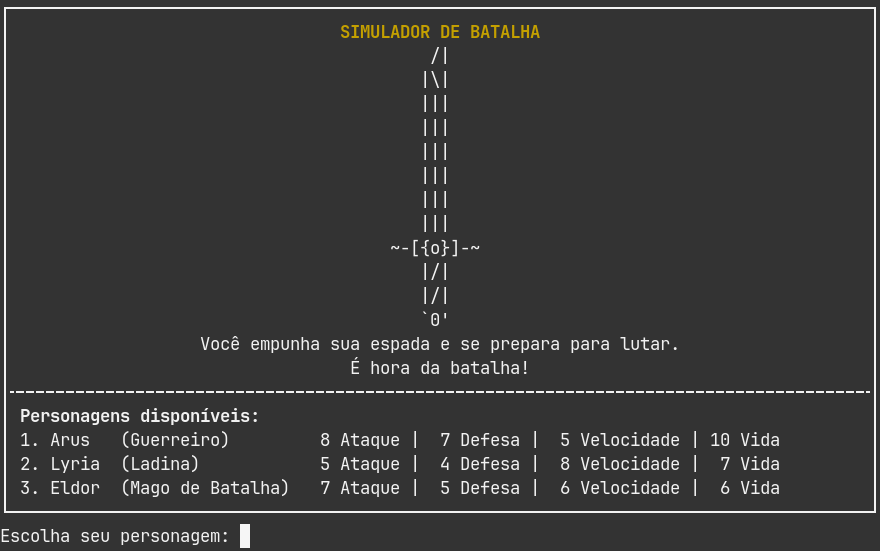
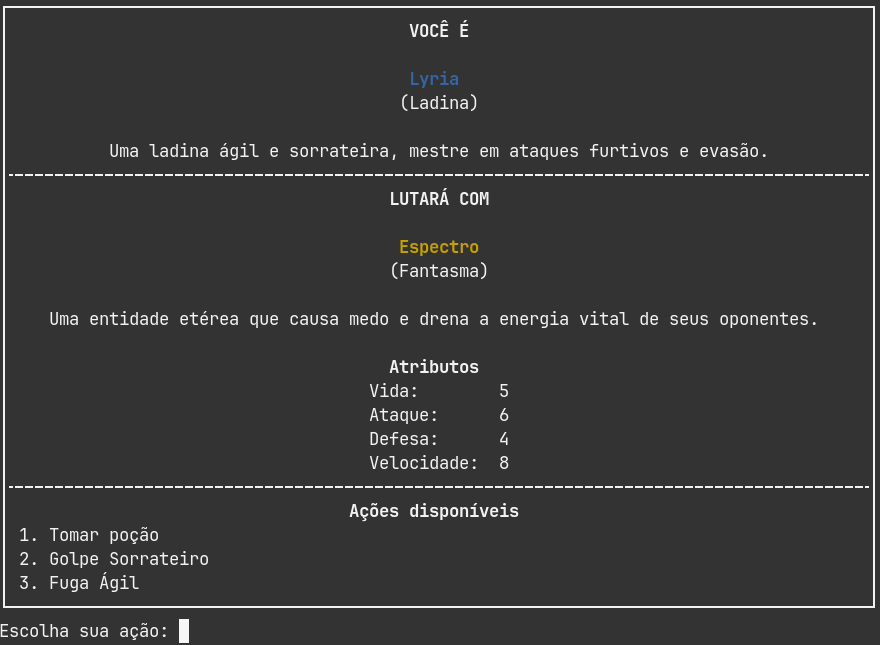
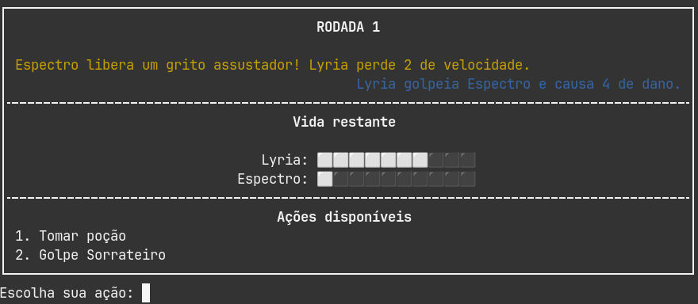

# Desafio 2

Criando um simulador de batalhas.

Para rodar o script basta usar comando:

```
$ lua main.lua
```

## Screenshots





## Comentários

Sim, a utilização de POO faria o  boilerplate ser bem menor, mas a ideia do desafio é usar apenas o que foi apresentado no curso até então.