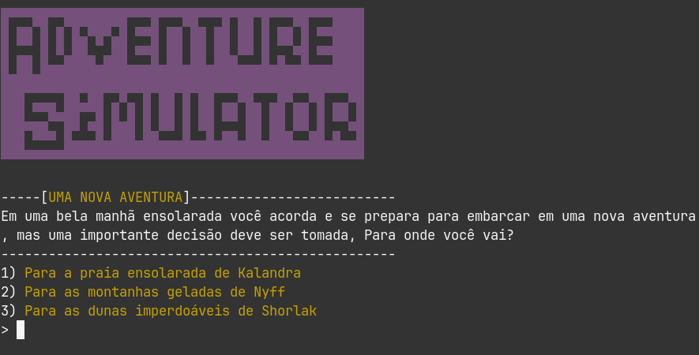
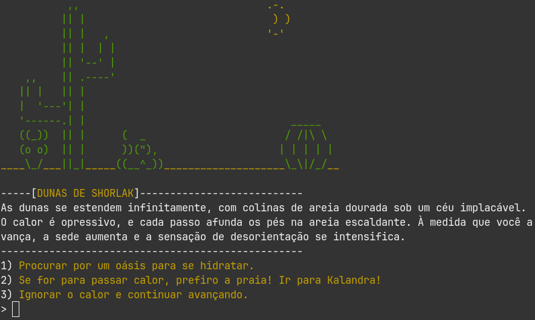
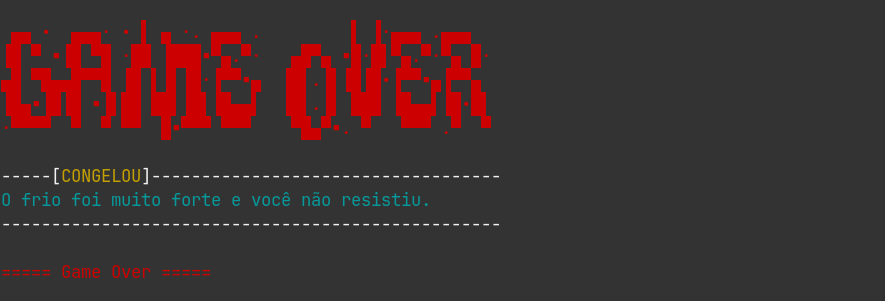

# Desafio 3

## Simulador de Aventuras

Criando um simulador de aventuras.

Para rodar o script basta usar comando:

```
$ lua main.lua
```

## Screenshots




## Alterações
Boa parte do código foi construído junto com as aulas do instrutor Rafael Skoberg. As alterações incluem
a adição de um método `addChoice` em `Node`, refatoramentos, novos nodes de `shorlak` e atualizações em 
documentação e organização do código.